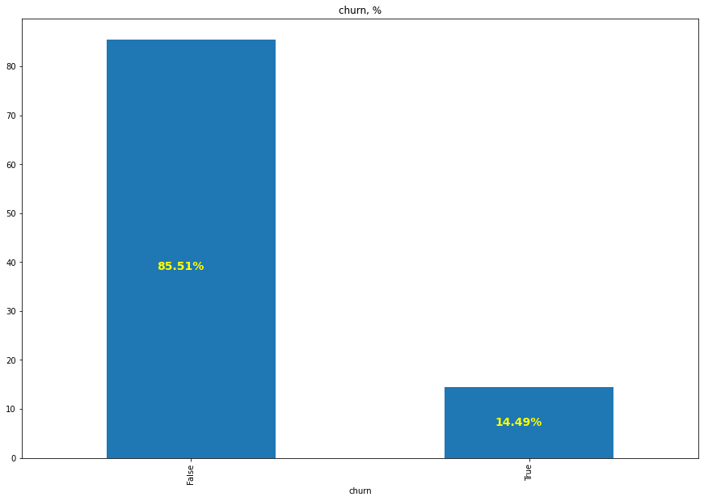
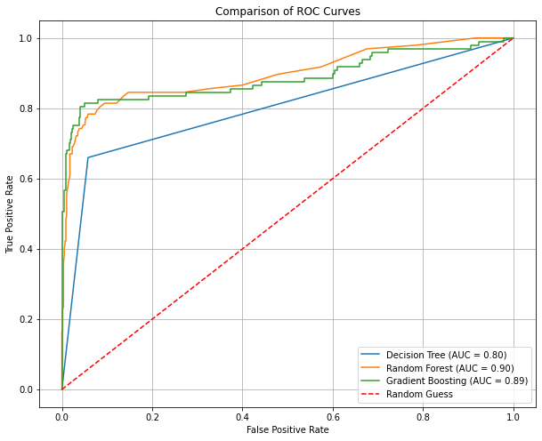

### 1.0 Project Title:

-  Predicting Customer Churn rate for SyriaTel using Logistic Regression: Enhancing Customer Retention Strategies

### Problem Statement:

- SyriaTel, a leading telecommunications provider, faces significant financial challenges due to customer churn, where customers discontinue their services. Identifying customers at risk of churn is critical for implementing proactive retention strategies and maintaining revenue growth. The goal of this project is to develop a predictive classification model that analyzes customer data to determine the likelihood of churn. By leveraging historical data, including customer demographics, usage patterns, and service-related metrics, this model aims to uncover actionable insights and predictable patterns of customer behavior. This will enable SyriaTel to focus retention efforts on at-risk customers, minimize churn-related losses, and enhance customer satisfaction, ultimately driving business sustainability.

### Dataset Overview

- The SyriaTel dataset contains 3333 rows and 21 columns comprising of; 16 Numerical columns and 4 Categorical columns and 1 Boolean column. The dataset has four data types (integer, float, object and boolean)

The Categorical columns includes: 
- State
- Phone number
- International plan
- voice mail plan

The Numerical columns includes:
- account length,
- area code,
- number vmail messages,
- total day minutes
- total day calls,
- total day charge,
- total eve minutes,
- total eve calls,
- total eve charge
- total night minutes
- total night calls,
- total night charge, 
- total intl minutes,
- total intl calls, 
- total intl charge
- customer service calls

Boolean Target: churn.

## Data Preparation and Data Cleaning
- The Data was prepared for analysis by Checking for missing values and duplicate columns
- No Missing Values: All columns have complete data.
- Descriprive statistics were used to understand the data structure, data types and check for unique values

## Data Visualization 
- A count plot was used to visualize the distribution of target column "Churn". This shows dataset is unbalanced with only 14.49% of objects belonging to class 1 (True). See the attached image- 
 C:\Users\ELITEBOOK\OneDrive\Desktop\DSF-08 Phase3 Project\Churn.png

- ROC Curves - this shows diagrom shows Random Forest performs slightly better than Gradient Boosting for this dataset, reflected by its higher AUC score and its curve being closer to the ideal top-left corner.

 C:\Users\ELITEBOOK\OneDrive\Desktop\DSF-08 Phase3 Project\ROC Curves.png

## Modelling

- Given the project was to solve a classification problem, the following models were selected for this problem:-
- - Logistic Regression Model – This was used to build a Baseline model which further Tuned to generate using scaling method to generate Best model
- - Decision Tree Model - 
- - Random Forest Model – ( This was selected as preferred model)
- - Gradient Boosting Model - 

## Recommendations:

- Random Forest Model is the preferred model for predicting churn rate by SyrialTel company based on performance. 

- Thus, SyrialTel management can use this model to predict Churn rate of the customers since it gives highest Overall Accuracy: 94%, F1-Score: 0.87 and a ROC-AUC score of 0.90, significantly better than the Decision Tree.

- Management should choose this model, because the model improves both precision and recall for the churn class compared to the Decision Tree. The higher ROC-AUC indicates better discrimination between classes.

